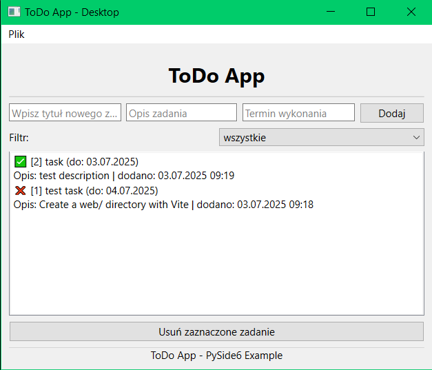

# ToDo_python

A simple ToDo application created to practice Python skills and expand my programming portfolio.

This directory contains three versions, a desktop app built with PySide6, a console app written in pure Python and a web version built with Vite + React + TypeScript, all connected to a Django REST backend. Depending on which one you wish to run, choose `desktop/` directory for the desktop version, `console/` directory for the console version or `web/` directory for the web version.

This project was built to practice structuring multi-layered Python applications (backend + desktop + CLI + web) and to demonstrate understanding of REST APIs, database migrations, and GUI design.

> Note: The desktop-version-PySide6 branch was merged into main and removed to keep the repository clean.

## Desktop Preview



## Web Preview


## 🚀 How to Start

### Requirements

> API uses [Django REST Framework](https://www.django-rest-framework.org/) for the API layer.

- [Poetry](https://python-poetry.org/docs/) must be installed
- Python 3.10+ recommended

### Running the app

Before running the app, install the required packages:

```bash
poetry install
```

1. Go to the `api/src` directory and run:

   ```bash
   poetry run python manage.py runserver
   ```

   > Desktop version

2. Once the server is running, go to the `desktop` directory and run:
   ```bash
   poetry run python main.py
   ```
   > Console version
3. Once the server is running, go to the `console/` directory and run:
   ```bash
   poetry run python ToDo.py
   ```
   > Web version
4. Once the server is running, go to the `web/` directory and run:
   ```bash
   npm i
   npm run dev
   ```

> ⚠️ Make sure all required packages are installed beforehand.

## 🗃️ API Setup

When running the project for the first time, you need to set up the database:

```bash
poetry run python manage.py makemigrations
poetry run python manage.py migrate
```

This will generate the database and create the required tables.

All the backend endpoints are located in `api/src/api/views.py`. The app provides the following API routes:

- `GET` – Returns all tasks from the database
- `POST` – Adds a new task
- `PATCH` – Updates the completion status of a task
- `DELETE` – Deletes a task

---

## 🧠 About `App.tsx` (Web version)

The `App.tsx` file contains the web frontend and all the logic that handles API requests and responses.

- `App` - Main function responsible for running every other part of this code
- `fetchTasks` - gets the tasks from the API so that the data can be used in the rest of the code
- `handleSubmit` - function that handles code behaviour after user submits the form for adding tasks
- `displayTasks` - displays all the tasks that have been fetched from the API in the table on the web
- `AddTask` - handles adding a task via an API request
- `UpdateTask` - handles changing task status in the database via an API request („Done” ⇄ „Undone”)
- `DeleteTask` - handles deleting tasks from the database via an API request

## 🧠 About `main_window.py` (Desktop version)

The `main_window.py` file contains the main layout and logic of the app. It includes:

- All the visual elements of the app that you are able to see and interact with once the app starts
- `display_menu()` – Displays the menu and handles user input
- `load_data()` – Utility function for fetching data from the backend.
- `add_task()`, `display_tasks()`, `mark_task_as_done()`, `delete_task()` – Main task-handling functions that interact with the backend

---

## 🧠 About `ToDo.py` (Console version)

The `ToDo.py` file contains the CLI logic and handles communication with the backend. It includes functions for API requests and the main application loop.

- `display_menu()` – Displays the menu and handles user input
- `load_data()` – Utility function for fetching data from the backend.
- `add_task()`, `display_tasks()`, `mark_task_as_done()`, `delete_task()` – Main task-handling functions that interact with the backend

---

## 📦 Structure

```
.
├── README.md                      # Project documentation
├── LICENSE                        # Project license
├── pyproject.toml                 # Poetry project configuration
├── poetry.lock                    # Exact versions of installed dependencies
├── main.py                        # Main entry point for the desktop application
├── api/
│   ├── src/
│   │   ├── api/                   # Django app for API
│   │   │   ├── __init__.py
│   │   │   ├── admin.py           # Django admin config (optional)
│   │   │   ├── apps.py            # App configuration
│   │   │   ├── models.py          # Database models
│   │   │   ├── serializers.py     # DRF serializers
│   │   │   ├── tests.py           # Unit tests for the app
│   │   │   ├── urls.py            # App-specific URL routes
│   │   │   └── views.py           # API views/endpoints
│   │   ├── myapi/                 # Django project configuration
│   │   │   ├── __init__.py
│   │   │   ├── asgi.py
│   │   │   ├── settings.py        # Main project settings
│   │   │   ├── urls.py            # Project URL routing
│   │   │   └── wsgi.py
│   │   ├── db.sqlite3             # SQLite database
│   │   └── manage.py              # Django management script
│   └── tests/
│       └── __init__.py            # Placeholder for tests
├── desktop/
│   ├── assets/                    # Static assets like icons, images or styles
│   ├── models/                    # Business logic and data layer for the desktop app
│   │   ├── __init__.py
│   │   └── api_client.py          # Handles API communication
│   └── ui/                        # User interface components
│       ├── __init__.py
│       └── main_window.py         # Main application window UI
├── console/
│   └── ToDo.py                    # Console CLI version of the application
└── web/                           # Frontend React + Vite application
    ├── node_modules/              # Node.js dependencies
    ├── public/                    # Static public assets (favicon, etc.)
    ├── src/                       # Source code of the frontend
    │   ├── assets/                # Images, icons, fonts used by React app
    │   ├── App.css                # App component styles
    │   ├── App.tsx                # Main App component
    │   ├── index.css              # Global styles
    │   ├── main.tsx               # React entry point
    │   └── vite-env.d.ts          # Vite TypeScript environment declarations
    ├── .gitignore                 # Files and folders to ignore by Git
    ├── eslint.config.js           # ESLint configuration
    ├── index.html                 # HTML template
    ├── package.json               # NPM project metadata and scripts
    ├── package-lock.json          # Exact versions of installed npm dependencies
    ├── tsconfig.json              # Base TypeScript configuration
    ├── tsconfig.app.json          # TypeScript config for app compilation
    ├── tsconfig.node.json         # TypeScript config for Node tools
    └── vite.config.ts             # Vite configuration file

```

---

## ✅ Example Features

- Task title, description, deadline
- Marking tasks as completed
- Deleting tasks
- Filtering tasks by status
- All data stored in a database via Django backend
- CLI

---

## 💡 Future Improvements

- Categories/tags
- Search options
- Sorting by deadline
- User Authentication

---

## 📜 License

Licensed under [CC0 1.0 Universal](https://creativecommons.org/publicdomain/zero/1.0/).
