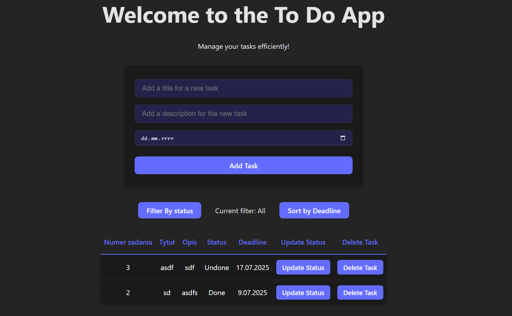

# ToDo_python

A simple ToDo application created to practice Python skills and expand my programming portfolio.

This directory contains three versions, a desktop app built with PySide6, a console app written in pure Python and a web version built with Vite + React + TypeScript, all connected to a Django REST backend. Depending on which one you wish to run, choose `desktop/` directory for the desktop version, `console/` directory for the console version or `web/` directory for the web version.

This project was built to practice structuring multi-layered Python applications (backend + desktop + CLI + web) and to demonstrate understanding of REST APIs, database migrations, and GUI design.

> Note: All the versions have their own tests if you wish to run them you can!

## 📚 Table of Contents

- [🚀 How to Start](#-how-to-start)
- [🐳 Docker Support](#-docker-support)
- [🗃️ API Setup](#-api-setup)
- [🧪 Tests](#-tests)
- [🧠 About App Files](#-about-app-files)
- [📦 Structure](#-structure)
- [✅ Example Features](#-example-features)
- [💡 Future Improvements](#-future-improvements)
- [🧪 Build & Run with Docker Compose](#-build--run-with-docker-compose)
- [🔄 GitHub Actions CI/CD](#-github-actions-cicd)
- [📜 License](#-license)

---

## Desktop Preview


## Web Preview



## 🚀 How to Start

## 🐳 Docker Support

You can now run the entire app using Docker!
[See Build & Run with Docker Compose section below for details.](#-build--run-with-docker-compose)

### Requirements

> API uses [Django REST Framework](https://www.django-rest-framework.org/) for the API layer.

- [Poetry](https://python-poetry.org/docs/) must be installed
- Python 3.10+ recommended

### Running the app

Before running the app, install the required packages:

```bash
poetry install
```

1. Go to the `api/src` directory and run:

   ```bash
   poetry run python manage.py runserver
   ```

   > Desktop version

2. Once the server is running, go to the `desktop` directory and run:
   ```bash
   poetry run python main.py
   ```
   > Console version
3. Once the server is running, go to the `console/` directory and run:
   ```bash
   poetry run python ToDo.py
   ```
   > Web version
4. Once the server is running, go to the `web/` directory and run:
   ```bash
   npm i
   npm run dev
   ```

> ⚠️ Make sure all required packages are installed beforehand.

## 🗃️ API Setup

When running the project for the first time, you need to set up the database:

```bash
poetry run python manage.py makemigrations
poetry run python manage.py migrate
```

This will generate the database and create the required tables.

All the backend endpoints are located in `api/src/api/views.py`. The app provides the following API routes:

- `GET` – Returns all tasks from the database
- `POST` – Adds a new task
- `PATCH` – Updates the completion status of a task
- `DELETE` – Deletes a task

---

## 🧪 Tests

This project includes tests for each part of the application:

- **Web**: `web/src/App.test.tsx` – unit tests for frontend logic and UI
- **Desktop**: `desktop/tests/` – unit tests for GUI components and business logic
- **Console**: `console/` - unit tests for CLI logic
- **Backend**: `api/src/api/tests/` – Django tests for API endpoints

To run the tests, go to the corresponding directory and use:

```bash
# For web
npm run test

# For backend
poetry run python manage.py test

# For console
poetry run python test.py

# For desktop
poetry run pytest
```

## 🧠 About `App.tsx` (Web version)

The `App.tsx` file contains the web frontend and all the logic that handles API requests and responses.

- `App` - Main function responsible for running every other part of this code
- `fetchTasks` - gets the tasks from the API so that the data can be used in the rest of the code
- `handleSubmit` - function that handles code behaviour after user submits the form for adding tasks
- `displayTasks` - displays all the tasks that have been fetched from the API in the table on the web
- `AddTask` - handles adding a task via an API request
- `UpdateTask` - handles changing task status in the database via an API request („Done” ⇄ „Undone”)
- `DeleteTask` - handles deleting tasks from the database via an API request

## 🧠 About `main_window.py` (Desktop version)

The `main_window.py` file contains the main layout and logic of the app. It includes:

- All the visual elements of the app that you are able to see and interact with once the app starts
- `display_menu()` – Displays the menu and handles user input
- `load_data()` – Utility function for fetching data from the backend.
- `add_task()`, `display_tasks()`, `mark_task_as_done()`, `delete_task()` – Main task-handling functions that interact with the backend

---

## 🧠 About `ToDo.py` (Console version)

The `ToDo.py` file contains the CLI logic and handles communication with the backend. It includes functions for API requests and the main application loop.

- `display_menu()` – Displays the menu and handles user input
- `load_data()` – Utility function for fetching data from the backend.
- `add_task()`, `display_tasks()`, `mark_task_as_done()`, `delete_task()` – Main task-handling functions that interact with the backend

---

## 📦 Structure

```
.
├── .github/
│   └── workflows/
│       └── docker-build.yml       # GitHub Actions workflow for building Docker images
├── README.md                      # Project documentation
├── LICENSE                        # Project license
├── pyproject.toml                 # Poetry project configuration
├── poetry.lock                    # Exact versions of installed dependencies
├── main.py                        # Main entry point for the desktop application
├── api/
│   ├── src/
│   │   ├── api/                   # Django app for API
│   │   │   ├── __init__.py
│   │   │   ├── admin.py           # Django admin config (optional)
│   │   │   ├── apps.py            # App configuration
│   │   │   ├── models.py          # Database models
│   │   │   ├── serializers.py     # DRF serializers
│   │   │   ├── tests/             # Unit tests for the app
│   │   │   ├── urls.py            # App-specific URL routes
│   │   │   └── views.py           # API views/endpoints
│   │   ├── myapi/                 # Django project configuration
│   │   │   ├── __init__.py
│   │   │   ├── asgi.py
│   │   │   ├── settings.py        # Main project settings
│   │   │   ├── urls.py            # Project URL routing
│   │   │   └── wsgi.py
│   │   ├── db.sqlite3             # SQLite database
│   │   └── manage.py              # Django management script
│   └── tests/
│       └── __init__.py            # Placeholder for tests
├── desktop/
│   ├── assets/                    # Static assets like icons, images or styles
│   ├── tests/                     # Unit tests for GUI
│   ├── models/                    # Business logic and data layer for the desktop app
│   │   ├── __init__.py
│   │   └── api_client.py          # Handles API communication
│   └── ui/                        # User interface components
│       ├── __init__.py
│       └── main_window.py         # Main application window UI
├── console/
│   ├── ToDo.py                    # Console CLI version of the application
│   └── test.py                    # Unit tests for the CLI
├── web/                           # Frontend React + Vite application
│    ├── node_modules/              # Node.js dependencies
│    ├── public/                    # Static public assets (favicon, etc.)
│    ├── src/                       # Source code of the frontend
│    │   ├── assets/                # Images, icons, fonts used by React app
│    │   ├── App.css                # App component styles
│    │   ├── App.test.tsx           # Unit tests for logic and web display elements
│    │   ├── App.tsx                # Main App component
│    │   ├── index.css              # Global styles
│    │   ├── main.tsx               # React entry point
│    │   └── vite-env.d.ts          # Vite TypeScript environment declarations
│    ├── .gitignore                 # Files and folders to ignore by Git
│    ├── eslint.config.js           # ESLint configuration
│    ├── index.html                 # HTML template
│    ├── package.json               # NPM project metadata and scripts
│    ├── package-lock.json          # Exact versions of installed npm dependencies
│    ├── tsconfig.json              # Base TypeScript configuration
│    ├── tsconfig.app.json          # TypeScript config for app compilation
│    ├── tsconfig.node.json         # TypeScript config for Node tools
│    └── vite.config.ts             # Vite configuration file
└──  docker/
   ├── docker-compose.yml         # Main Docker Compose file to run all services
   ├── dockerfile.backend         # Dockerfile for the Django backend
   ├── dockerfile.web             # Dockerfile for the web frontend
   ├── dockerfile.desktop         # Dockerfile for the desktop GUI app
   └── dockerfile.console         # Dockerfile for the console CLI version

```

---

## ✅ Example Features

- Task title, description, deadline
- Marking tasks as completed
- Deleting tasks
- Filtering tasks by status
- All data stored in a database via Django backend
- CLI

---

## 💡 Future Improvements

- Categories/tags
- Search options
- Sorting by deadline
- User Authentication

---

## 🧪 Build & Run with Docker Compose

Make sure you have Docker and Docker Compose installed.

> You can install Docker Desktop here: [Install Docker Desktop](https://docs.docker.com/desktop/setup/install/windows-install/)

```bash
cd docker
docker-compose up --build
```

This will spin up the following services:

- 🐍 backend (Django API)
- 🌐 web (Vite + React)
- 🖥️ desktop (PySide6 GUI)
- 💻 console (CLI version)

> Note: Desktop and Console services run in containers and are mainly useful for debugging and CI — local use is still easier outside Docker.

To Stop the container you can either do so manually in docker desktop or by:

```bash
docker-compose down *container-name*
```

## 🔄 GitHub Actions CI/CD

This repository includes a GitHub Actions workflow at:

```bash
.github/workflows/docker-build.yml
```

This workflow automatically builds and validates all Docker images on every push to ensure your containers stay in a working state.

## 📜 License

Licensed under [CC0 1.0 Universal](https://creativecommons.org/publicdomain/zero/1.0/).
